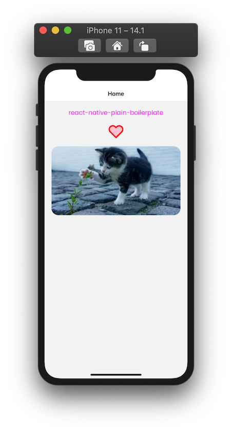

# react-native-plain-boilerplate

## Introduction

Start shaping up your react-native apps immediately with this boilerplate. If you are tired of cleaning up bloated boilerplates just to get started, this might be an option for you.

Stop wasting your time with basic configurations and start having results.

## What's in it?

- react-native v0.63.2
- typescript
- react-navigation
- styled-components
- styled-system
- svgr/cli
- path aliases
- react-native-fast-image

## Folder Structure

```bash
├── android/
├── ios/
├── assets
│   ├── fonts/
│   ├── images/
│   └── svg/
├── src
│   ├── App.tsx
│   ├── components/
│   │   ├── icons/
│   │   └── primitive/
│   ├── context/
│   ├── definitions/
│   │   └── styled/
│   ├── navigation/
│   ├── screens/
│   └── typings/
├── app.json
├── global.d.ts
├── index.js
├── metro.config.js
├── package-lock.json
├── package.json
├── react-native.config.js
└── tsconfig.json
```

## Example Screen



## Contributing

All PR's, issues and comments are welcome as long as you keep it simple and polite.
